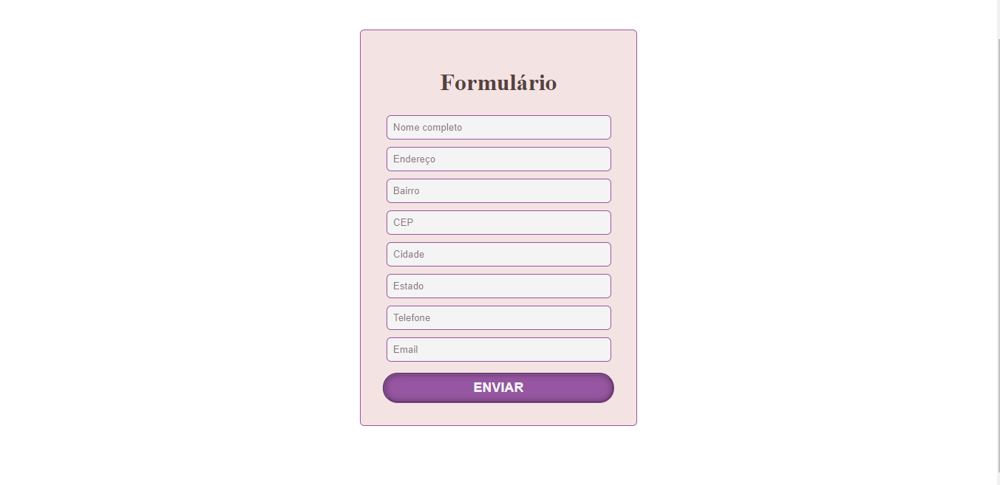

# Formulário com PHP

**Exercício:** formulário simples que coleta os dados pessoais de uma pessoa e, em seguida, apresenta os dados em uma nova página pelo método **POST**.

#### **Página do formulário**

